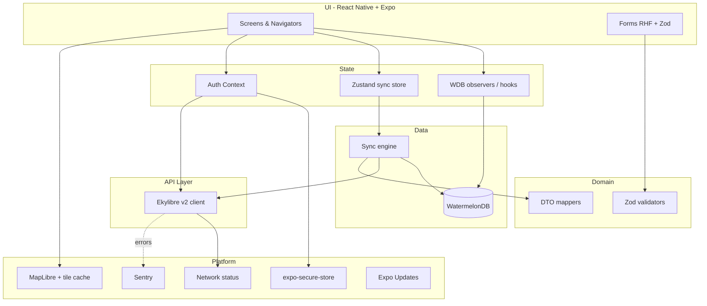
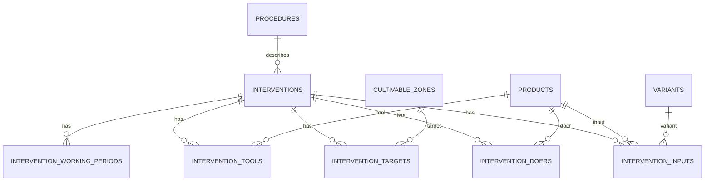
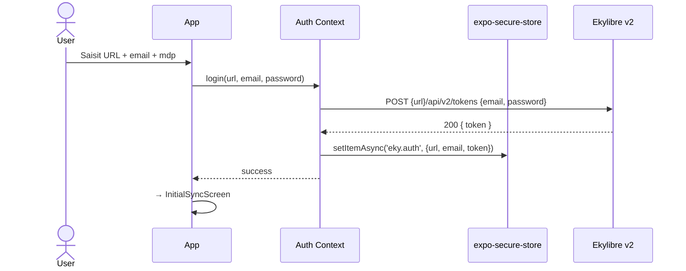
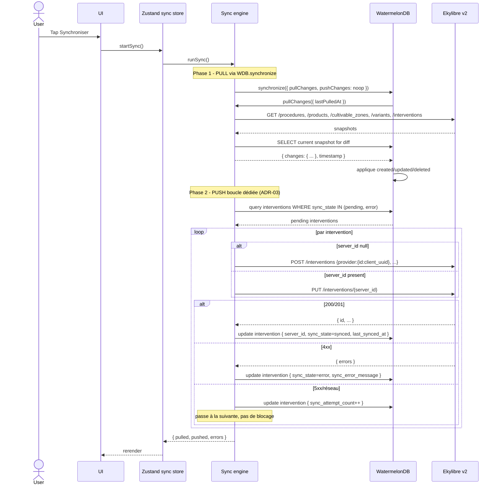
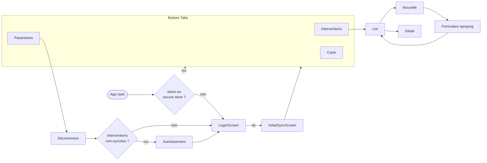

# zero-mobile — Architecture v1

> Document produit par `/sc:design` le 2026-05-10, à partir de
> `docs/brainstorm-requirements.md`. Ce document fige les **choix
> d'architecture** et les **interfaces** ; aucune implémentation
> exécutable n'y figure (cf. boundaries de `/sc:design`).
> Phase suivante : `/sc:implement` avec `/sc:workflow` pour le
> jalonnement.

## 0. Décisions actées (synthèse)

| #      | Décision                                                                                               | Rationale                                                                                                                                                                                                                                                     |
| ------ | ------------------------------------------------------------------------------------------------------ | ------------------------------------------------------------------------------------------------------------------------------------------------------------------------------------------------------------------------------------------------------------- |
| ADR-01 | Expo SDK + **Development Build** (pas Expo Go)                                                         | WatermelonDB requiert du code natif (JSI). EAS Build pour iOS+Android.                                                                                                                                                                                        |
| ADR-02 | **WatermelonDB** comme base locale                                                                     | Lazy loading, optimisé offline, observables natifs, intégration RN mature.                                                                                                                                                                                    |
| ADR-03 | **WatermelonDB `synchronize()`** pour le pull catalogue ; **boucle dédiée** pour le push interventions | `synchronize().pushChanges` est tout-ou-rien ; l'API REST v2 d'Ekylibre exige une gestion d'erreurs par intervention (statuts individuels). On garde le protocole WDB là où il sert (lecture catalogue), on s'en affranchit là où il nuit (écriture). Cf. §6. |
| ADR-04 | **MapLibre Native** (RN) + tuiles **OSM**                                                              | Choix brainstorm. Cache de tuiles offline via MBTiles ou cache HTTP.                                                                                                                                                                                          |
| ADR-05 | **React Navigation v7** (Stack + Bottom Tabs)                                                          | Standard RN, intégration dev tools.                                                                                                                                                                                                                           |
| ADR-06 | **React Hook Form + Zod** pour les formulaires                                                         | Validation typée, réutilisable comme validation domaine stricte.                                                                                                                                                                                              |
| ADR-07 | **Zustand** pour l'état éphémère (status sync) ; **WDB observables** pour le domaine                   | Pas de Redux. Pas de Context excessif.                                                                                                                                                                                                                        |
| ADR-08 | **expo-secure-store** pour token + URL d'instance + email                                              | Keychain iOS / Keystore Android.                                                                                                                                                                                                                              |
| ADR-09 | **i18next + react-i18next** dès la v1                                                                  | FR seul livré, architecture prête.                                                                                                                                                                                                                            |
| ADR-10 | **Sentry** (RN) pour crash reporting                                                                   | DSN par environnement (dev/staging/pilote).                                                                                                                                                                                                                   |
| ADR-11 | **Expo Updates** (OTA) activé sur le canal pilote                                                      | Patcher rapidement le panel sans re-build.                                                                                                                                                                                                                    |
| ADR-12 | **TypeScript strict** sur tout le code                                                                 | Cohérence avec `Zod`, contrat API typé via DTO.                                                                                                                                                                                                               |
| ADR-13 | **Idempotence par UUID client** (`provider.id`)                                                        | Évite la duplication observée dans zero-kotlin lors d'éditions ; double protection serveur.                                                                                                                                                                   |

## 1. Vue d'ensemble



### Couches (séparation stricte)

1. **UI** — JSX, navigation, présentation pure.
2. **State** — observables WDB pour le domaine, Zustand pour l'éphémère.
3. **Domain** — types, schémas Zod, mappers DTO ↔ modèle WDB. Pur TS,
   testable sans device.
4. **Data** — modèles WDB, migrations, sync engine. Aucun import UI.
5. **API** — client HTTP, DTO. Aucun import des couches supérieures.
6. **Platform** — wrappers d'API natives (sécurité, réseau, carte,
   observabilité). Stable et testable via mocks.

## 2. Arborescence du repo

```
zero-mobile/
├── app/                          # Expo Router ou écrans
│   ├── (auth)/
│   │   ├── login.tsx
│   │   └── initial-sync.tsx
│   ├── (tabs)/
│   │   ├── interventions/
│   │   │   ├── index.tsx        # liste
│   │   │   ├── new.tsx          # picker procédure (spraying en v1)
│   │   │   ├── spraying.tsx     # formulaire pulvérisation
│   │   │   └── [id].tsx         # détail
│   │   ├── map.tsx
│   │   └── settings.tsx
│   └── _layout.tsx
├── src/
│   ├── core/
│   │   ├── api/                 # client HTTP, endpoints, DTO
│   │   ├── auth/                # AuthContext, login flow
│   │   ├── db/                  # WDB schema, models, migrations
│   │   ├── sync/                # sync engine
│   │   ├── i18n/                # i18next config + locales
│   │   └── observability/       # Sentry setup
│   ├── features/
│   │   ├── intervention/        # use cases métier
│   │   ├── catalog/             # exposition des produits/parcelles
│   │   └── map/                 # MapLibre helpers
│   ├── domain/
│   │   ├── intervention.ts      # types + Zod schemas
│   │   └── procedures/
│   │       └── spraying.ts      # règles spécifiques v1
│   └── ui/                      # composants réutilisables
├── assets/
├── locales/
│   └── fr/common.json
├── docs/
│   ├── brainstorm-requirements.md
│   └── architecture.md          # ce fichier
└── (Expo / EAS configs)
```

## 3. Modèle de données local (WatermelonDB)

### Schéma v1 (cardinalité couvrant la v1 + le futur proche)

```typescript
// schema v1
appSchema({
  version: 1,
  tables: [
    tableSchema({
      name: 'procedures',
      columns: [
        { name: 'name', type: 'string', isIndexed: true }, // ex: "spraying"
        { name: 'label_fr', type: 'string' },
        { name: 'definition_json', type: 'string' }, // XML→JSON pour v1.5
        { name: 'updated_at_server', type: 'number' },
      ],
    }),

    tableSchema({
      name: 'products',
      columns: [
        { name: 'server_id', type: 'number', isIndexed: true },
        { name: 'product_type', type: 'string', isIndexed: true }, // worker | equipment | matter | ...
        { name: 'name', type: 'string' },
        { name: 'variant_id', type: 'number', isOptional: true },
        { name: 'variety', type: 'string', isOptional: true },
        { name: 'updated_at_server', type: 'number' },
      ],
    }),

    tableSchema({
      name: 'variants',
      columns: [
        { name: 'server_id', type: 'number', isIndexed: true },
        { name: 'name', type: 'string' },
        { name: 'category', type: 'string' }, // plant_medicine | seed | ...
        { name: 'unit', type: 'string', isOptional: true },
        { name: 'updated_at_server', type: 'number' },
      ],
    }),

    tableSchema({
      name: 'cultivable_zones',
      columns: [
        { name: 'server_id', type: 'number', isIndexed: true },
        { name: 'name', type: 'string' },
        { name: 'geometry_geojson', type: 'string' }, // FeatureCollection sérialisé
        { name: 'area_hectares', type: 'number', isOptional: true },
        { name: 'updated_at_server', type: 'number' },
      ],
    }),

    tableSchema({
      name: 'interventions',
      columns: [
        { name: 'client_uuid', type: 'string', isIndexed: true }, // UUIDv4 stable, → provider.id
        { name: 'server_id', type: 'number', isOptional: true, isIndexed: true },
        { name: 'procedure_name', type: 'string' }, // immuable post-création
        { name: 'started_at', type: 'number' }, // epoch ms
        { name: 'stopped_at', type: 'number' },
        { name: 'whole_duration_seconds', type: 'number' },
        { name: 'working_duration_seconds', type: 'number' },
        { name: 'description', type: 'string', isOptional: true },
        { name: 'sync_state', type: 'string', isIndexed: true }, // pending | syncing | synced | error
        { name: 'sync_error_message', type: 'string', isOptional: true },
        { name: 'sync_attempt_count', type: 'number' },
        { name: 'last_synced_at', type: 'number', isOptional: true },
        { name: 'created_at', type: 'number' },
        { name: 'updated_at', type: 'number' },
      ],
    }),

    // 1 ligne par doer/input/target/tool/working_period d'une intervention.
    // Pas de table outputs en v1 (pas requis pour spraying).
    tableSchema({
      name: 'intervention_doers',
      columns: [
        { name: 'intervention_id', type: 'string', isIndexed: true },
        { name: 'product_id', type: 'string' }, // FK locale vers products
        { name: 'reference_name', type: 'string' }, // "driver" pour spraying
      ],
    }),
    tableSchema({
      name: 'intervention_inputs',
      columns: [
        { name: 'intervention_id', type: 'string', isIndexed: true },
        { name: 'product_id', type: 'string' },
        { name: 'variant_id', type: 'string', isOptional: true },
        { name: 'reference_name', type: 'string' }, // "plant_medicine"
        { name: 'quantity_value', type: 'number' },
        { name: 'quantity_handler', type: 'string' }, // "population" | "net_mass" | ...
        { name: 'quantity_unit', type: 'string', isOptional: true },
      ],
    }),
    tableSchema({
      name: 'intervention_targets',
      columns: [
        { name: 'intervention_id', type: 'string', isIndexed: true },
        { name: 'cultivable_zone_id', type: 'string' }, // FK locale
        { name: 'reference_name', type: 'string' }, // "cultivation" pour spraying
      ],
    }),
    tableSchema({
      name: 'intervention_tools',
      columns: [
        { name: 'intervention_id', type: 'string', isIndexed: true },
        { name: 'product_id', type: 'string' },
        { name: 'reference_name', type: 'string' }, // "sprayer" pour spraying
      ],
    }),
    tableSchema({
      name: 'intervention_working_periods',
      columns: [
        { name: 'intervention_id', type: 'string', isIndexed: true },
        { name: 'started_at', type: 'number' },
        { name: 'stopped_at', type: 'number' },
        { name: 'duration_seconds', type: 'number' },
        { name: 'nature', type: 'string' }, // "intervention" par défaut
      ],
    }),

    tableSchema({
      name: 'sync_state', // singleton: 1 seule ligne
      columns: [
        { name: 'last_pulled_at', type: 'number', isOptional: true },
        { name: 'last_pull_status', type: 'string' }, // ok | error
        { name: 'last_pull_error', type: 'string', isOptional: true },
      ],
    }),
  ],
});
```

### ER local



### Choix de modélisation justifiés

- **`client_uuid`** sur `interventions` → utilisé comme `provider.id` au
  POST. Garantit l'idempotence et permet de lier la réponse serveur
  (`server_id`) au record local sans race condition (ADR-13).
- **Pas de table `outputs` en v1** — non requis par la procédure pilote
  `spraying`. Ajout en v1.5 quand on couvrira `harvesting`.
- **`geometry_geojson` sérialisé en string** — WatermelonDB ne supporte
  pas nativement les types complexes ; sérialisation à l'écriture,
  parsing au rendu carte.
- **`sync_state` table singleton** — un seul utilisateur connecté à la
  fois en v1, pas besoin de prefixer par compte (cf. v2 multi-comptes).
- **Foreign keys « lâches »** — WatermelonDB n'enforce pas les FK ; on
  stocke des IDs en string (id local WDB) et on s'appuie sur les
  relations déclarées dans les modèles TS pour la navigation.

## 4. Couche API

### Authentification — flux



### Header d'authentification

`Authorization: simple-token <email> <token>` injecté par
l'intercepteur du client HTTP. Sur 401, `AuthContext` purge le token
et redirige vers `LoginScreen`.

### Interface du client

```typescript
// src/core/api/client.ts (interface, pas implémentation)
export interface EkylibreApiClient {
  // Auth
  login(input: { url: string; email: string; password: string }): Promise<{ token: string }>;
  logout(): Promise<void>;

  // Catalogue
  listProcedures(): Promise<ProcedureDto[]>;
  listProducts(productType: ProductType): Promise<ProductDto[]>;
  listCultivableZones(): Promise<CultivableZoneDto[]>;
  listVariants(): Promise<VariantDto[]>;

  // Interventions
  listInterventions(opts?: {
    modifiedSince?: Date;
    userEmail?: string;
  }): Promise<InterventionDto[]>;
  createIntervention(payload: CreateInterventionPayload): Promise<InterventionDto>;
  updateIntervention(
    serverId: number,
    payload: UpdateInterventionPayload,
  ): Promise<InterventionDto>;
}

export type ProductType = 'workers' | 'equipments' | 'matters' | 'plants' | 'animals';

// Provider obligatoire au POST (ADR-13)
export interface ProviderTag {
  vendor: 'ekylibre-mobile';
  name: 'zero-mobile';
  id: string; // client_uuid de l'intervention
  data: {
    app_version: string;
    os: 'ios' | 'android';
    device_model?: string;
    locale: string; // ex: "fr-FR"
  };
}

export interface CreateInterventionPayload {
  procedure_name: string;
  description?: string;
  actions: string[];
  provider: ProviderTag;
  working_periods_attributes: { started_at: string; stopped_at: string }[];
  doers_attributes: { product_id: number; reference_name: string }[];
  inputs_attributes: {
    product_id: number;
    variant_id?: number;
    reference_name: string;
    quantity_value: number;
    quantity_handler: string;
  }[];
  targets_attributes: { product_id: number; reference_name: string }[];
  tools_attributes: { product_id: number; reference_name: string }[];
}

export type UpdateInterventionPayload = Omit<CreateInterventionPayload, 'provider'> & {
  provider?: ProviderTag;
};
```

### Stratégie d'erreurs

| Code      | Comportement                                                                           |
| --------- | -------------------------------------------------------------------------------------- |
| 200/201   | Succès, parse DTO.                                                                     |
| 401       | Token invalide/révoqué → AuthContext purge et redirige. Aucune retry.                  |
| 403       | Permissions insuffisantes → message clair, pas de retry.                               |
| 404       | Ressource inconnue → log Sentry (probable bug client).                                 |
| 412 / 422 | Validation serveur → propage `errors[]` au sync engine pour stockage par intervention. |
| 5xx       | Erreur serveur → 1 retry avec backoff (1s, 4s) puis échec.                             |
| Réseau    | Pas de retry transparent ; informe la UI.                                              |

## 5. État éphémère (Zustand)

```typescript
// src/core/sync/store.ts
interface SyncStore {
  status: 'idle' | 'pulling' | 'pushing' | 'error';
  lastPulledAt: number | null;
  pendingCount: number; // dérivé de WDB, mis à jour par observable
  errorMessage: string | null;
  startSync: () => Promise<void>;
  reset: () => void;
}
```

Le statut « pendingCount » est _dérivé_ d'une query WDB
`q(Q.where('sync_state', Q.notEq('synced')))`, observable. Le store
Zustand expose juste l'état du cycle de sync en cours.

## 6. Moteur de synchronisation

### Cycle complet (au tap « Synchroniser »)



### Pourquoi pas `synchronize().pushChanges` (ADR-03 détaillé)

`synchronize()` exécute `pushChanges()` dans une transaction
tout-ou-rien : si elle throw, **toutes** les modifications locales
sont marquées comme « non-pushées » à retenter ; si elle passe,
**toutes** sont marquées « synced », même celles que le serveur a
rejetées par 422.

Pour Ekylibre, on veut le comportement inverse :

- l'intervention A passe (200) → marquée `synced` ;
- l'intervention B échoue (422 « cardinalité doer ») → marquée
  `error` avec le message serveur, l'utilisateur la corrige ;
- l'intervention C tombe sur un timeout réseau → reste `pending`
  pour la prochaine sync.

D'où le découpage : pull via le protocole WDB (lecture pure, où
tout-ou-rien convient bien), push via une boucle dédiée qui met à
jour l'état de chaque intervention indépendamment.

### Diff client-side pour le pull

Pour chaque table catalogue, l'engine fait :

1. `local = WDB.collections.get(table).query().fetch()`
2. `remote = await api.list...()`
3. Indexe par `server_id`, calcule :
   - `created` = `remote \ local` (server_id absent en local)
   - `updated` = `remote ∩ local` où `updated_at_server` change
   - `deleted` = `local \ remote` (présent en local, absent côté API)
4. Construit le manifest WDB `{ table: { created, updated, deleted } }`.

Hypothèse de volumétrie « petite ferme » (< 500 parcelles, < 1 000
produits) → diff complet acceptable. Si on dépasse, on évoluera vers
un endpoint `?modified_since=` côté Ekylibre (point ouvert, cf. §11).

### Idempotence

- Chaque intervention locale a un `client_uuid` (UUIDv4) figé à la
  création.
- Au POST, ce UUID est envoyé dans `provider.id`.
- Si l'utilisateur tape « Synchroniser » deux fois sur une connexion
  flaky et que le premier POST a abouti côté serveur sans qu'on l'ait
  appris, le second POST avec le même `provider.id` doit être traité
  comme un upsert côté Ekylibre. **Question ouverte : confirmer
  qu'Ekylibre dédoublonne sur `provider.id`** (sinon, il faut
  préfixer le push d'un GET pour vérifier).

## 7. Validation locale stricte (Zod)

```typescript
// src/domain/procedures/spraying.ts
export const sprayingInterventionSchema = z
  .object({
    procedure_name: z.literal('spraying'),
    started_at: z.date(),
    stopped_at: z.date(),
    description: z.string().optional(),
    doers: z
      .array(
        z.object({
          product_id: z.string(),
          reference_name: z.literal('driver'),
        }),
      )
      .min(1, 'Au moins 1 conducteur requis'),
    inputs: z
      .array(
        z.object({
          product_id: z.string(),
          variant_id: z.string().optional(),
          reference_name: z.literal('plant_medicine'),
          quantity_value: z.number().positive(),
          quantity_handler: z.string(),
        }),
      )
      .min(1, 'Au moins 1 produit phytosanitaire requis'),
    targets: z
      .array(
        z.object({
          cultivable_zone_id: z.string(),
          reference_name: z.literal('cultivation'),
        }),
      )
      .length(1, 'Exactement 1 parcelle cible'),
    tools: z
      .array(
        z.object({
          product_id: z.string(),
          reference_name: z.literal('sprayer'),
        }),
      )
      .min(1, 'Au moins 1 pulvérisateur requis'),
  })
  .refine((i) => i.stopped_at > i.started_at, {
    message: 'La fin doit être après le début',
    path: ['stopped_at'],
  });

export type SprayingIntervention = z.infer<typeof sprayingInterventionSchema>;
```

- Validation invoquée par RHF `zodResolver` au submit.
- Validation également invoquée côté sync engine **avant** push
  (filet de sécurité). Une intervention non-valide ne devrait
  jamais atteindre le sync engine, mais on coupe en ceinture.

## 8. Navigation



### Politique de déconnexion (ADR + brainstorm Q1 levée)

À l'appui de « Déconnexion » :

1. Si interventions non-syncées (`sync_state ≠ synced`), afficher
   un avertissement listant le nombre d'éléments perdus.
2. Confirmation explicite « Effacer et déconnecter » → purge :
   - Token (`expo-secure-store`)
   - Toutes les tables WDB (catalogue + interventions)
3. Retour à `LoginScreen`.

## 9. Cartographie

- **MapLibre Native** (RN) avec un style raster pointant sur des
  tuiles OSM (fournisseur à fixer en implémentation : OSM officiel
  pour le pilote, basculement possible vers MapTiler/Stadia si
  rate-limité).
- **Tuiles offline** : précachage par bbox au moment de la sync
  initiale, sur la zone englobant les `cultivable_zones` + 5 km de
  marge. Stockage MBTiles dans le sandbox de l'app.
- **Affichage** : couche de polygones depuis les
  `cultivable_zones.geometry_geojson`, tap → sélection de la cible.
- **Pas d'édition de géométrie en v1** (cf. brainstorm).

## 10. Cross-cutting

### i18n

- `i18next` + `react-i18next` initialisés dans `src/core/i18n/`.
- Locales dans `locales/{fr,en,...}/common.json`.
- v1 : `fr` seul livré. Aucune chaîne UI en dur.

### Observabilité (Sentry)

- DSN injecté via Expo config (variables d'env EAS).
- Breadcrumbs auto sur navigation, fetch, console.error.
- Tag : `app.version`, `eky.instance` (URL d'instance).
- PII : email **non** envoyé à Sentry (anonymiser via `beforeSend`).

### OTA (Expo Updates)

- Canal `pilot` distinct de `production`.
- Politique : check au démarrage, téléchargement en background,
  application au prochain démarrage (pas de force-restart).
- Fallback : si runtime version incompatible, pas d'update auto.

### Sécurité

- TLS strict, pas de cleartext autorisé (à l'inverse de zero-kotlin).
- Token via `expo-secure-store` ; clés dérivées Keychain/Keystore.
- Email + URL d'instance également chiffrés (utiles pour pré-remplir
  le LoginScreen sans exposer à un éventuel attaquant ayant accès au
  système de fichiers).
- Pas de biométrie en v1 (cf. brainstorm).

### Politique d'erreurs UI

- Toast non-bloquants pour erreurs transitoires (réseau, timeouts).
- Banner persistant tant qu'il y a des interventions en `error`.
- Écran « Détail intervention » affiche le `sync_error_message` brut
  - bouton « Réessayer » (qui re-tente au prochain cycle de sync).

## 11. Stratégie de tests

| Couche                | Outil                          | Cible v1                                                          |
| --------------------- | ------------------------------ | ----------------------------------------------------------------- |
| Domain (Zod, mappers) | Jest                           | 100% du code de validation et mapping                             |
| Sync engine           | Jest + mocks WDB + mocks fetch | Cycles pull/push, gestion d'erreurs par intervention, idempotence |
| API client            | Jest + MSW                     | Headers, parsing DTO, gestion 401                                 |
| UI                    | RN Testing Library             | Smoke test du formulaire spraying et du LoginScreen               |
| E2E                   | Maestro (ou Detox)             | 1 scénario : login → saisie offline → sync → vérif liste          |

## 12. Limites et questions ouvertes

Reportées du brainstorm + nouvelles soulevées par le design :

1. **Idempotence Ekylibre sur `provider.id`** — confirmer que l'API
   v2 dédoublonne sur ce champ ; sinon, ajouter un GET défensif
   avant POST.
2. **Endpoint `?modified_since=`** — exists-il sur `/interventions`
   uniquement (vu dans le briefing API) ou aussi sur les catalogues ?
   Si oui, le diff complet pourra être remplacé par un delta serveur.
3. **Rate limits Ekylibre** — non documentés ; à mesurer sur le
   pilote, et adapter le concurrency du pull (Promise.all vs
   séquentiel).
4. **Pagination `/products` et `/variants`** — l'API ne pagine pas
   explicitement ; comportement à valider sur catalogue moyen-grand.
5. **Procédure XML pour v1.5** — se procurer la définition machine
   (XML ou JSON) de toutes les procédures Ekylibre via
   `GET /procedures/{name}` ; la cardinalité et les handlers de
   quantité seront le socle du moteur de formulaire dynamique.
6. **Cache des tuiles OSM** — choix du fournisseur (OSM direct,
   MapTiler, Stadia, Geoportail) selon le quota et les CGU ; à
   trancher avant les premiers builds publics.
7. **Politique de mises à jour de schéma WDB** — convention
   d'incrément + migrations à formaliser avant le 2ᵉ release.
8. **Multi-comptes (v2)** — documenter dès maintenant comment le
   schéma actuel évoluera (probable ajout d'une table `accounts` et
   d'un `account_id` partout).
9. **Couverture catalogue à la sync initiale** — décider si l'app
   bloque en initial-sync (catalogue obligatoire) ou si elle laisse
   passer en mode dégradé. Recommandation : bloquante en v1 (pas de
   formulaire utilisable sans catalogue).
10. **Suppression côté serveur** — si Ekylibre supprime une parcelle
    référencée par une intervention locale, comportement à définir
    (refus de sync, alerte utilisateur, fallback). Hors v1.

## Hand-off

**Étape suivante recommandée** :

1. **`/sc:workflow`** — convertir cette architecture en plan
   d'implémentation jalonné (sprint 1 : bootstrap + auth, sprint 2 :
   modèle local + catalogue, sprint 3 : formulaire spraying,
   sprint 4 : sync engine, sprint 5 : carte + déco + polish + Sentry).
2. **`/sc:implement`** — exécuter sprint par sprint, en commençant
   par le bootstrap Expo + WatermelonDB + EAS.
3. **CLAUDE.md** — à créer une fois le squelette du projet RN
   poussé (commandes Expo/EAS, conventions TS, layout des modules
   tels que définis ici).
