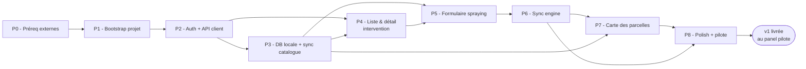

# zero-mobile — Workflow d'implémentation v1

> Document produit par `/sc:workflow` le 2026-05-10, à partir de
> `docs/brainstorm-requirements.md` et `docs/architecture.md`.
> **Plan uniquement** — aucun code n'est livré ici (cf. boundaries).
> Phase suivante : `/sc:implement` phase par phase.
>
> Estimations en T-shirt size (S = quelques jours, M = ~1 semaine,
> L = ~2 semaines, XL = >2 semaines pour un dev solo). Pas de date
> calendaire, le rythme dépend de l'équipe disponible.

## 0. Vue d'ensemble — Phases & dépendances

| Phase                            | Effort | Pré-requis | Démontrable                                            |
| -------------------------------- | ------ | ---------- | ------------------------------------------------------ |
| P0 — Préreq externes             | S      | —          | Comptes & accès débloqués                              |
| P1 — Bootstrap projet            | M      | P0         | App vide builde sur device iOS+Android                 |
| P2 — Auth + API client           | M      | P1         | Login fonctionnel sur instance Ekylibre réelle         |
| P3 — DB locale + catalogue       | L      | P2         | Catalogue téléchargé et observable                     |
| P4 — Liste & détail intervention | S      | P3         | Liste vide affichée, états de sync visibles            |
| P5 — Formulaire spraying         | L      | P3, P4     | Saisie complète d'une pulvérisation, sauvée localement |
| P6 — Sync engine                 | L      | P3, P5     | Pull + push avec gestion d'erreurs par intervention    |
| P7 — Carte des parcelles         | M      | P3         | Sélection de parcelle via la carte                     |
| P8 — Polish + pilote             | M      | P6, P7     | Build distribué TestFlight + Internal Testing          |

Chemin critique : **P0 → P1 → P2 → P3 → P5 → P6 → P8** (carte et liste
sont parallélisables si plusieurs devs).

## 1. P0 — Préreq externes (S)

**Objectif** : débloquer tout ce qui dépend de tiers (accès, comptes,
clés) avant que la première ligne de code ne soit tapée.

### Livrables

- Compte **Apple Developer** d'Ekylibre actif (sinon, lancer la
  procédure d'inscription, qui prend plusieurs jours).
- Compte **Google Play Console** actif.
- Compte **Expo / EAS** d'organisation (pas un compte personnel).
- Projet **Sentry** créé (org Ekylibre), DSN obtenus pour
  `dev` / `pilot` (et `prod`, même si pas utilisé en v1).
- **Instance Ekylibre de test** avec API v2 activée, identifiants
  utilisateur de test, et un catalogue minimal (≥1 procédure
  spraying disponible, ≥1 parcelle, ≥1 produit phyto, ≥1
  pulvérisateur, ≥1 ouvrier).
- **Décision sur les tuiles cartographiques** : OSM direct,
  MapTiler, Stadia, ou Geoportail (cf. question ouverte §11 de
  l'architecture). Token réservé si nécessaire.

### Définition de fini

- Tous les comptes sont propres aux Ekylibre (pas personnels).
- Les DSN Sentry et le token cartographique sont stockés dans un
  password manager partagé, pas dans le repo.
- Un dev peut se logger sur l'instance Ekylibre de test via le
  navigateur et lister les `/api/v2/interventions` via curl.

### Risques

- Validation Apple Developer = plusieurs jours à plusieurs semaines.
  À lancer au plus tôt.
- Catalogue de test pauvre = découverte tardive de cas non couverts
  (ex: produit sans variant). Prévoir un script ou un seed pour
  enrichir l'instance.

## 2. P1 — Bootstrap projet (M)

**Objectif** : avoir un squelette d'app Expo qui builde et se lance
sur iOS et Android, avec toute la chaîne de qualité en place.

### Livrables

- `package.json` avec **Expo SDK** récent et **TypeScript strict**
  (`strict: true`, `noUncheckedIndexedAccess: true`).
- **Expo Development Build** configuré (pas Expo Go, à cause de
  WatermelonDB en P3).
- **EAS Build** configuré (`eas.json` avec profils
  `development` / `preview` / `pilot`).
- **EAS Submit** configuré pour iOS + Android (placeholder).
- **Expo Updates** activé avec canaux `dev` et `pilot`.
- **React Navigation v7** : stack racine + Bottom Tabs vides.
  Splash + écran « Hello » pour valider le rendu.
- **i18next + react-i18next** : `locales/fr/common.json` avec une
  clé d'exemple, hook `useT()` câblé.
- **Sentry** initialisé, DSN injecté via `eas.json` env, capture
  testée par un crash volontaire en debug.
- **ESLint + Prettier** (config Expo + TS strict).
- **Husky + lint-staged** : `lint`, `typecheck`, `test` sur
  pre-commit.
- **CI** (GitHub Actions ou équivalent) : `lint`, `typecheck`,
  `test`, `eas build --profile development --non-interactive` sur
  PR (ou simplement `expo prebuild --clean` en CI pour valider la
  cohérence native).
- **Arborescence** posée selon `architecture.md` §2 (`src/core`,
  `src/features`, `src/domain`, `src/ui`, `app/`, `locales/`).
- **CLAUDE.md** initial créé (commandes Expo/EAS, lint/typecheck,
  conventions TS, structure des modules).

### Dépendances

- P0 (comptes, DSN).

### Définition de fini

- `eas build --profile development` produit un build Android et iOS
  installable.
- App lance sur device, affiche « Hello », bottom tabs cliquables.
- `pnpm test` et `pnpm typecheck` sont verts en CI.
- Crash volontaire (`throw` dans un handler) est visible dans
  Sentry.
- Hot reload fonctionne avec le dev client (changement de string FR
  → reload immédiat).

### Risques

- WatermelonDB n'est pas encore intégré en P1 ; il faudra rebuild
  le dev client à P3 (penser à le préparer mentalement).
- Compatibilité Expo SDK ↔ versions natives : lock une version au
  début, ne pas la bumper en cours de v1.

### Quality gate

- 0 erreur ESLint, 0 erreur TS strict, CI verte.
- `expo doctor` sans warning.

## 3. P2 — Auth + API client (M)

**Objectif** : un utilisateur peut se logger sur son instance
Ekylibre depuis l'app et son token est stocké de façon chiffrée.

### Livrables

- `src/core/api/client.ts` — interface définie dans
  `architecture.md` §4, implémentée pour les endpoints d'auth :
  - `POST /api/v2/tokens`
  - Header `Authorization: simple-token <email> <token>` injecté
    par intercepteur fetch.
- `src/core/auth/secure-storage.ts` — wrapper `expo-secure-store`
  pour `eky.auth` (URL d'instance + email + token).
- `src/core/auth/AuthContext.tsx` — provider + hook `useAuth()`,
  états : `unauthenticated` / `authenticated` / `loading`.
  Re-hydrate au démarrage depuis secure-storage.
- Gestion **401** : purge du token, redirection vers
  `LoginScreen`, log Sentry.
- `app/(auth)/login.tsx` — formulaire **RHF + Zod** (URL,
  email, password). Validation simple : URL (https), email valide,
  password ≥1 caractère. Erreur réseau et 401 affichés clairement.
- `app/(tabs)/settings.tsx` — bouton « Déconnexion » (sans
  avertissement pending pour l'instant — câblé à P6).
- Tests Jest :
  - API client : login OK, login 401, login 5xx, header injecté.
  - AuthContext : transitions d'état, persistence/rehydratation.
  - LoginScreen : Zod schema (URL invalide, email vide, etc.).

### Dépendances

- P1.

### Définition de fini

- Login sur l'instance Ekylibre de test (P0) réussit en device.
- Token visible dans le Keychain/Keystore via debug, pas en clair
  ailleurs.
- Tuer + relancer l'app = utilisateur toujours connecté.
- Bouton « Déconnexion » purge le token et redirige sur Login.
- 401 simulé par révocation manuelle du token côté Ekylibre →
  redirection automatique sur Login.

### Risques

- L'API d'Ekylibre peut renvoyer une erreur de format différente
  selon les versions ; figer le format observé en P0 dans des
  fixtures de test.
- `expo-secure-store` a des limites de taille (~2 KB par clé) :
  stocker les 3 valeurs dans une seule clé JSON pour rester sous
  la limite avec marge.

### Quality gate

- Couverture Jest ≥ 80% sur `src/core/api/` et `src/core/auth/`.

## 4. P3 — DB locale + sync catalogue (L)

**Objectif** : WatermelonDB intégrée, schéma v1 en place,
téléchargement initial du catalogue Ekylibre observable depuis l'UI.

### Livrables

- **WatermelonDB intégrée** au dev client : adapter SQLite, JSI
  activé (rebuild EAS dev client requis — refaire au moment où
  ça sera nécessaire).
- `src/core/db/schema.ts` — schéma v1 complet (cf. architecture §3).
- `src/core/db/models/*.ts` — Models WDB pour les 11 tables avec
  les associations TypeScript (`@relation`, `@children`).
- `src/core/db/database.ts` — instanciation, exposée via un hook.
- **Migrations** : convention posée (`migrations/v1.ts` vide pour
  l'init), même si v1 n'a qu'une seule version.
- DTO TypeScript (`ProcedureDto`, `ProductDto`, `VariantDto`,
  `CultivableZoneDto`, `InterventionDto`) avec Zod validators
  (parsing strict des réponses API → erreur de parse Sentry).
- **Mappers DTO ↔ Model** (`src/domain/mappers/*.ts`).
- **API client étendu** : `listProcedures`, `listProducts(type)`,
  `listCultivableZones`, `listVariants`, `listInterventions`.
- `src/features/catalog/initial-sync.ts` — fonction qui :
  1. Appelle les 4 endpoints catalogue séquentiellement.
  2. Insère/upsert dans WDB par batch.
  3. Met à jour `sync_state.last_pulled_at` à la fin.
- `app/(auth)/initial-sync.tsx` — écran avec progress bar
  (4 étapes : procédures, produits, parcelles, variants), bloque
  l'accès aux tabs tant que la sync initiale n'a pas réussi.
- **Hooks observables** : `useProcedures()`,
  `useProductsByType(type)`, `useCultivableZones()`,
  `useInterventions()` — retournent des observables WDB.
- Tests :
  - Mappers (chaque DTO → Model + roundtrip).
  - Insertion catalogue par batch (perf : 1 000 produits insérés
    en < 1s).
  - Reprise après interruption (sync coupée sur produits,
    relance complète OK).

### Dépendances

- P2 (API client + auth).

### Définition de fini

- Premier login sur instance de test → `initial-sync` télécharge
  les 4 catalogues, l'écran de progression avance, l'app passe sur
  les tabs.
- Tuer l'app pendant la sync initiale → relance reprend depuis le
  catalogue en cours (idempotent).
- Liste de procédures observable : un changement direct dans la
  WDB (via debug) rerender l'écran qui l'affiche.
- Volumétrie « petite ferme » (< 500 parcelles, < 1 000 produits) :
  sync initiale < 60s sur 4G simulée.

### Risques

- WatermelonDB + Expo : la doc officielle WDB n'a pas toujours été
  à jour vis-à-vis d'Expo. Prévoir une demi-journée de friction
  d'intégration.
- L'API Ekylibre ne pagine pas explicitement → si une instance de
  test a un catalogue plus gros que prévu, le `fetch` peut prendre
  > 30s. Mesurer et instrumenter dès cette phase.
- Désérialisation Zod sur de gros tableaux : surveillance perf
  (parser en background si > 50 ms cumulés).

### Quality gate

- Couverture Jest ≥ 80% sur `src/core/db/`, `src/domain/mappers/`,
  `src/features/catalog/`.
- Validation Zod stricte sur tous les DTO catalogue.

## 5. P4 — Liste & détail intervention (S)

**Objectif** : afficher les interventions locales (vides pour
l'instant) avec leurs états de sync.

### Livrables

- `app/(tabs)/interventions/index.tsx` — liste des interventions
  triées par `started_at` desc, avec badge d'état
  (`pending` / `synced` / `error`) et compteur global « N à
  synchroniser ».
- `app/(tabs)/interventions/[id].tsx` — détail (lecture seule en
  v1, l'édition pourra arriver en v1.5).
- État vide soigné (FR i18n).
- Pull-to-refresh (sur la liste) qui appelle le sync engine
  (placeholder avant P6, juste un re-fetch des interventions
  serveur).
- Tests UI : RN Testing Library, smoke sur la liste avec données
  mockées (3 interventions : 1 synced, 1 pending, 1 error).

### Dépendances

- P3 (modèle Intervention en DB).

### Définition de fini

- Naviguer entre liste et détail fonctionne.
- L'état des interventions s'observe en temps réel (insertion
  manuelle en DB → liste qui se met à jour sans navigation).

### Quality gate

- 0 string en dur dans la UI ; toutes via i18n.

## 6. P5 — Formulaire spraying (L)

**Objectif** : un agriculteur peut saisir une pulvérisation
complète, hors-ligne, et la sauvegarder localement.

### Livrables

- `src/domain/procedures/spraying.ts` — schéma Zod et types (cf.
  architecture §7).
- `app/(tabs)/interventions/new.tsx` — picker de procédure (en v1
  une seule option : « Pulvérisation »). Si l'utilisateur choisit
  spraying, navigation vers le formulaire spécifique.
- `app/(tabs)/interventions/spraying.tsx` — formulaire complet :
  - Date/heure début + fin (pickers natifs).
  - Sélecteur de **parcelle cible** : liste filtrable des
    `cultivable_zones` (la sélection cartographique vient en P7).
  - Sélecteur de **conducteur** (`driver`) : produits de type
    `worker`.
  - Sélecteurs **multi-intrants phyto** (`plant_medicine`) :
    chaque ligne = produit + variant + quantité + handler.
  - Sélecteur de **pulvérisateur** (`sprayer`) : produits de
    type `equipment` (filtre par `variety` à confirmer côté
    catalogue).
  - Notes libres (description).
- Bouton « Enregistrer » : valide via Zod (refus si invalide,
  messages FR par champ), génère `client_uuid`, écrit
  l'intervention + ses relations en transaction WDB,
  `sync_state = pending`, retour vers la liste.
- Tests :
  - Schéma Zod : tous les cas d'invalidation (pas de driver, pas
    de phyto, dates inversées, etc.).
  - Form smoke : remplissage minimal valide → enregistrement OK.
  - DB : intervention créée a bien ses relations dans les 4
    tables enfants.

### Dépendances

- P3 (catalogue), P4 (liste pour redirection).

### Définition de fini

- Une intervention spraying valide est sauvegardée en DB,
  apparaît dans la liste avec état `pending`.
- Une intervention invalide est bloquée à la sauvegarde, chaque
  champ fautif est signalé en FR.
- Mode avion activé sur le device : la saisie reste pleinement
  fonctionnelle.

### Risques

- L'ergonomie de la saisie phyto (multi-lignes avec handlers de
  quantité) est le point UX le plus délicat. Prévoir une revue
  avec un agriculteur du panel pilote dès qu'un proto est jouable.
- Les `quantity_handler` valides pour `plant_medicine` dépendent
  du produit (`population`, `net_volume`, `area_density`...). En v1,
  proposer le handler par défaut du produit s'il existe, sinon
  une liste réduite. Documenter le périmètre couvert.

### Quality gate

- Couverture Jest ≥ 90% sur le schéma Zod spraying.
- 1 scénario E2E Maestro/Detox : login (mocké) → saisie spraying
  minimale → présence dans la liste.

## 7. P6 — Sync engine (L)

**Objectif** : le bouton « Synchroniser » pousse les interventions
locales vers Ekylibre et tire les changements distants, avec
gestion d'erreurs par intervention.

### Livrables

- `src/core/sync/engine.ts` — orchestrateur :
  - **Pull** via `WatermelonDB.synchronize({ pullChanges })`,
    `pushChanges` neutralisé. Implémente le diff client-side par
    table (cf. architecture §6).
  - **Push** via boucle dédiée (cf. ADR-03) :
    - Query interventions WHERE `sync_state IN (pending, error)`.
    - Pour chaque intervention : POST si pas de `server_id`,
      PUT sinon. Provider tag toujours présent au POST avec
      `provider.id = client_uuid`.
    - Gestion d'erreurs détaillée (matrice §4 architecture).
- `src/core/sync/store.ts` — Zustand store (status, lastPulledAt,
  pendingCount, errorMessage).
- `src/core/sync/payload-builder.ts` — construction du payload
  imbriqué `CreateInterventionPayload` à partir d'une intervention
  WDB et de ses relations.
- `app/(tabs)/interventions/index.tsx` — bouton « Synchroniser »
  - bandeau d'état + bandeau persistant tant qu'il y a des erreurs
    de sync.
- `app/(tabs)/interventions/[id].tsx` — affichage de
  `sync_error_message` brut + bouton « Réessayer » qui marque
  `sync_state = pending` (re-tenté au prochain cycle).
- `app/(tabs)/settings.tsx` — finalisation logout : avertissement
  « N interventions non-synchronisées seront perdues » +
  confirmation explicite avant purge.
- Tests :
  - Diff catalogue (created/updated/deleted, edge cases : produit
    supprimé côté serveur, produit modifié).
  - Cycle push : 200, 422, 5xx, timeout — états résultants en DB.
  - Idempotence : double-tap « Synchroniser » sur connexion flaky
    (premier succès non perçu) → pas de duplication serveur (test
    avec mock qui simule la situation).
  - Pas de régression sur les interventions `synced` lors d'un
    cycle (elles ne sont pas re-poussées).

### Dépendances

- P3 (catalogue + tables interventions), P5 (interventions
  saisissables).

### Définition de fini

- Scénario complet : login → saisie 3 spraying en mode avion →
  retour Wi-Fi → tap « Synchroniser » → les 3 apparaissent dans
  Ekylibre web ; états en local passent à `synced`.
- Scénario d'erreur : saisie une intervention invalide
  (artificiellement, en bypassant la validation locale → écrire
  directement en DB) → push → état passe à `error`, message
  serveur affiché dans le détail.
- Scénario d'idempotence : couper le réseau juste après l'envoi
  d'une intervention, relancer la sync → pas de doublon dans
  Ekylibre.

### Risques majeurs

- **Idempotence côté Ekylibre** (question ouverte §11.1
  architecture) : si `provider.id` n'est pas dédoublonné côté
  serveur, ajouter un `GET /interventions?provider_id=<uuid>`
  défensif avant chaque POST. **Sortir cette question des « ouvertes »
  AVANT P6**, par un test en bac à sable sur l'instance Ekylibre.
- L'API peut rejeter un payload pour des raisons non couvertes
  par la validation locale (ex: produit qui n'autorise pas tel
  handler de quantité). Le message serveur doit être lisible par
  l'agriculteur ; sinon, prévoir un mapping FR.

### Quality gate

- Couverture Jest ≥ 85% sur `src/core/sync/`.
- 1 scénario E2E qui couvre saisie + sync + apparition côté serveur
  (avec instance Ekylibre de test).

## 7bis. Incrément post-P6 — UI, cibles cultures & édition (2026-05-31)

Incrément réalisé après la validation P6 on-device, hors découpage
initial P0–P8 (refonte ergonomique alignée sur l'ancienne app
`zero-android-v3` + deux fonctionnalités demandées).

### Livré

- **Refonte UI saisie** (accordéons, résumés repliés, multi-cibles,
  icônes de procédure reprises des drawables Android, primitives sur
  tokens de thème).
- **Cibles cultures** en plus des parcelles : `client.listPlants()`
  (`?product_type=plants`), table `cultivable_zones` unifiée avec
  colonne `kind` (schéma WDB **v3**), ingestion à delete-extras **par
  kind**, picker affichant les deux types (sous-titre Parcelle/Culture).
- **Édition d'intervention** : route `spraying?id=`, préremplissage du
  formulaire (`initialValues` / `toFormValues`),
  `updateSprayingIntervention` (1 write + 1 batch : update + delete
  enfants + recréation, repasse `sync_state='pending'`). Autorisée
  uniquement si non synchronisée (`pending`/`error`) ; entrées
  « Modifier » sur la liste et le détail.
- **Message d'erreur de sync affiché** in-app (le serveur renvoie les
  erreurs de validation en **403** `{errors:[…]}` → désormais classées
  `ValidationError` et affichées verbatim sur le détail/ligne).

### Décisions

- Stockage **unifié** parcelles/cultures (vs deux tables) — `kind`
  porté par le persister.
- `reference_name='cultivation'` pour toute cible spraying.
- **Pas de filtrage shape à l'ingestion** — fallback sur le 403.
- Picker **liste plate** (kind en sous-titre), pas de section-headers.
- Édition **interdite si `synced`** (la ligne existe côté Ekylibre).

### Reste

- Filtrage des handlers par produit (conditions `if` de la procédure).
- 1 scénario E2E + test unitaire de la route d'édition (intégration).
- Re-sync catalogue obligatoire sur device (colonne `kind`, migration
  JS, pas de rebuild natif).

## 8. P7 — Carte des parcelles (M)

**Objectif** : visualiser les parcelles sur une carte et permettre
la sélection cartographique de la cible d'intervention.

### Livrables

- `@maplibre/maplibre-react-native` intégré au dev client (rebuild
  EAS).
- `src/features/map/MapView.tsx` — composant carte stylé OSM,
  centre par défaut sur le centroïde des `cultivable_zones`.
- Couche de polygones depuis `cultivable_zones.geometry_geojson`
  (couleur par défaut, surlignage à la sélection).
- Tap sur une parcelle = sélection (callback exposé pour le
  formulaire spraying).
- `app/(tabs)/map.tsx` — carte plein écran, navigation vers détail
  parcelle (lecture seule).
- Intégration dans `app/(tabs)/interventions/spraying.tsx` :
  alternative cartographique au sélecteur en liste.
- **Cache de tuiles offline** : précachage par bbox couvrant les
  cultivable_zones + 5 km, déclenché en fin de sync initiale et de
  chaque sync ultérieure si la bbox a changé. MBTiles dans le
  sandbox de l'app.
- Tests : parsing GeoJSON, calcul de bbox, sélection.

### Dépendances

- P3 (cultivable_zones en DB).

### Définition de fini

- Carte affiche les parcelles en hors-ligne (mode avion).
- Sélection cartographique fonctionne dans le formulaire spraying.
- Cache de tuiles vérifié : couper le réseau après sync, fermer
  l'app, rouvrir → carte toujours navigable sur la zone précachée.

### Risques

- Quotas / CGU des fournisseurs OSM : trancher en P0 (point
  ouvert) ; si pas de décision avant P7, démarrer avec OSM direct
  - rate limit côté client (max N tiles/sec).
- Géométries malformées dans Ekylibre (multi-polygones SRID 4326
  attendus mais variations possibles) : prévoir un fallback
  d'affichage et un log Sentry sur parse échoué.

### Quality gate

- Aucune crash sur géométrie malformée (test fixtures).

## 9. P8 — Polish + pilote (M)

**Objectif** : build pilote distribué, app prête à être mise dans
les mains des agriculteurs du panel.

### Livrables

- **Accessibilité** : passe sur tous les écrans (tailles tap,
  contrastes, lecteur d'écran sur les actions principales).
- **i18n** : revue de toutes les chaînes FR par un humain (pas par
  un dev seul).
- **Métriques** : log dans Sentry (en breadcrumbs ou events
  custom) :
  - Volumétrie observée (`procedures.count`, `products.count`,
    `cultivable_zones.count`, `variants.count`) à chaque sync
    initiale → réfute/confirme l'hypothèse « petite ferme ».
  - Durée de chaque cycle de sync.
  - Nombre d'erreurs de sync par intervention.
- **OTA** : canal `pilot` actif, tests d'OTA validés (publier un
  patch trivial et vérifier qu'il s'applique).
- **TestFlight** : build pilote uploadé, testeurs externes
  invités.
- **Internal Testing** Play Console : équivalent Android.
- **Release notes** v1 (FR) pour les pilotes.
- **CLAUDE.md** mis à jour avec la commande de release pilote
  (`eas build --profile pilot --auto-submit`) et les conventions
  finales du projet.
- **README.md** mis à jour : statut, prérequis dev, commandes,
  pointeur vers `docs/`.
- **Onboarding pilote** : 1 doc en FR pour les agriculteurs
  pilotes (URL d'instance, comment installer TestFlight, scénario
  type, comment remonter les bugs).

### Dépendances

- P6 (sync), P7 (carte).

### Définition de fini

- Le scénario d'acceptation v1 (cf. brainstorm §7) passe chez 3
  utilisateurs pilotes différents, sur leurs propres téléphones
  (≥1 iOS + ≥1 Android).
- Aucun crash bloquant remonté en Sentry sur 7 jours d'usage par
  les pilotes.
- Les 10 questions ouvertes du design sont soit fermées
  (réponse trouvée) soit explicitement reportées en v2 avec
  contexte mis à jour.

### Quality gate

- 0 erreur ESLint, 0 erreur TS strict, CI verte sur la dernière
  release pilote.
- Couverture globale ≥ 75% (lignes), ≥ 90% sur les modules sync
  et validation domaine.

## 10. Workstreams transverses

Ces chantiers progressent à chaque phase, pas en bloc :

### 10.1. Tests

- **P1+** : Jest + RN Testing Library installés. Snapshot interdit
  pour la UI (préférer assertions explicites).
- **P2+** : MSW pour mocker l'API Ekylibre.
- **P5+** : Maestro (ou Detox) pour 1 scénario E2E par phase
  fonctionnelle.
- Couverture **min 80%** sur `src/domain/`, `src/core/sync/`,
  `src/core/api/`, `src/core/auth/`.

### 10.2. Documentation

- `CLAUDE.md` : créé en P1, mis à jour à chaque phase qui change
  les commandes ou la structure.
- `docs/architecture.md` : maintenu vivant (les ADRs ne se
  réécrivent pas, mais on précise les questions ouvertes au fur et
  à mesure qu'elles sont fermées).
- `docs/CHANGELOG-v1.md` : créé en P1, alimenté à chaque PR
  significative.

### 10.3. CI/CD

- **P1** : lint + typecheck + tests sur PR.
- **P2** : ajout d'un job de validation des fixtures API (parse
  Zod sur les exemples Ekylibre).
- **P5** : ajout du smoke E2E sur émulateur.
- **P8** : pipeline release pilote `eas build --profile pilot
--auto-submit` déclenchable manuellement.

### 10.4. Observabilité

- **P1** : Sentry installé, source maps uploadées par EAS.
- **P3+** : breadcrumbs sur les phases de sync initiale.
- **P6+** : events custom pour les cycles de sync (durée, erreurs).
- **P8** : tableau de bord Sentry réservé au pilote, alertes sur
  taux de crash > seuil.

### 10.5. Sécurité

- Audit léger après P2 (auth) et après P6 (sync) : grep des
  secrets, vérification Keychain/Keystore, vérification que les
  logs ne fuitent pas le token.
- TLS only à toutes les phases, jamais de cleartext autorisé.

### 10.6. Décisions ouvertes à clore en cours de route

Suivi explicite à chaque démo de phase :

| Question (issue de architecture §11)        | À clore au plus tard avant          |
| ------------------------------------------- | ----------------------------------- |
| Idempotence Ekylibre sur `provider.id`      | P6                                  |
| Pagination `/products` et `/variants`       | P3 (mesure de volume)               |
| Endpoint `?modified_since=` côté catalogues | P6                                  |
| Choix fournisseur de tuiles                 | P7 (ou P0 si possible)              |
| Politique de mises à jour de schéma WDB     | P3                                  |
| Couverture catalogue à la sync initiale     | P3                                  |
| Comportement sur suppression serveur        | Reportée v2, documentée             |
| Multi-comptes (impact schéma)               | Reportée v2, schéma déjà compatible |
| Rate limits Ekylibre                        | P3 ou P6 selon symptômes            |
| Procédure XML pour v1.5                     | Reportée à la phase v1.5            |

## 11. Checkpoints / démos

À chaque fin de phase, **démo synchrone (devs + 1 personne métier)**
sur device réel. Les points de démo sont les `Définition de fini` de
chaque phase.

Démos clés (où le métier doit être présent) :

- Fin **P3** : « Voilà mon catalogue téléchargé, ça reflète bien ma
  ferme ? »
- Fin **P5** : « Voilà l'écran de saisie, est-ce qu'il a tout ? »
  → première chance d'attraper un manque ergonomique.
- Fin **P6** : « Voilà le scénario complet hors-ligne → sync, ça te
  va ? »
- Fin **P8** : remise du build pilote.

## 12. Roll-up vers le critère d'acceptation v1

Selon `docs/brainstorm-requirements.md` §7, la v1 est livrée quand :

1. Build TestFlight + Internal Testing distribué — fait à **P8**.
2. Mis aux mains d'un panel pilote — fait à **P8**.
3. Scénario complet (login → sync init → saisie offline → sync →
   vérification web) chez ≥3 utilisateurs pilotes différents
   (≥1 iOS + ≥1 Android) — vérifié pendant et après **P8**.

**Le passage en stores publics n'est pas dans la v1**, et ne le
sera qu'après les retours du panel pilote.

## Hand-off

**Étape suivante** : `/sc:implement` sur **P0 (préreq externes)**,
qui peut être lancé en parallèle de l'amorçage code de **P1**
(rien dans P1 ne bloque sur P0 sauf la fin = mise en CI avec les
DSN Sentry réels).

Pour chaque phase, créer une branche `feat/P<n>-<nom-court>` et
n'enchaîner sur la suivante qu'une fois la « Définition de fini »
de la phase courante validée en démo.
